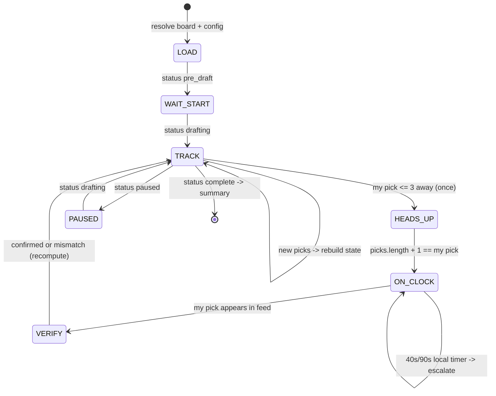

# Draft Bot — Execution Plan (Engine + Console Notifier)

**Status:** Draft for review · **Owner:** Andrew · **Branch:** `claude/sleeper-api-draft-selection-wua79b`

## 1. Goal

Build a draft assistant that watches a live Sleeper draft, scores the available players against Andrew's tiered board plus current roster needs, and emits a pick instruction (one primary + two fallbacks) at exactly the right moments. The instruction is delivered by a `Notifier`; this plan builds the engine and a **console notifier** only. A human relay (the league commissioner) executes picks in the Sleeper app — the Sleeper API is read-only, so the bot verifies outcomes by watching the pick feed, never by writing.

Out of scope for this plan (Phase 4 preview only): WhatsApp/Telegram delivery, the GitHub Actions live runner, and the autodraft fallback-queue compiler. Everything here is designed so those bolt on without reworking the engine.

## 2. Constraints that shape the design

| Constraint | Consequence |
|---|---|
| Sleeper API is read-only, no auth | Bot observes and instructs; confirmation loop closes by polling `/draft/<id>/picks`, not by inbound messages |
| Development sandbox cannot reach `api.sleeper.app` | **Fixture-first development.** All engine/replay work runs on committed JSON snapshots. Live fetching is confined to two small scripts run where the network is open (Andrew's machine or a GitHub Actions runner) |
| Human actuator with latency | Every instruction carries ranked fallbacks; a verify step detects mismatches and recomputes from the roster actually held |
| Existing repo: Next 13, TS 4.8 `strict`, static export to Pages | Engine is pure TypeScript under `helpers/draft/` with zero DOM/React/Next imports, so a future web page and the bot script share it unchanged |
| Redraft league (lads) | Age/`years_exp` weighted zero; value comes from the current-season board. No rookie-pick handling |
| Board is ranked **with tiers** | Tier plateaus drive the value function; no external projections required |
| Rate limit ~1000 calls/min | 3 s poll ≈ 20 calls/min — far inside the limit; still implement backoff |

## 3. Architecture at a glance

```
scripts/
  fetchFixtures.ts      snapshot league/draft/players JSON (runs off-sandbox)
  resolveBoard.ts       board names -> Sleeper player_ids; fails loudly on ambiguity
  replay.ts             run engine against a completed draft; metrics + snapshots
  draftbot.ts           live loop: poll -> state machine -> engine -> notifier
helpers/draft/
  types.ts              Sleeper + engine domain types
  snake.ts              pick-number math (snake/linear, reversal round, traded picks)
  state.ts              picks feed -> BoardState (pool, rosters, on-clock, my next picks)
  needs.ts              roster_positions -> per-position need weights + forced-slot logic
  value.ts              tier/rank -> numeric value; off-board ADP interpolation
  survival.ts           Monte Carlo opponent model -> P(survive), E[best at next pick]
  recommend.ts          decision rule + guardrails -> Recommendation
  rng.ts                seeded PRNG (mulberry32) for deterministic sims/tests
  notifier.ts           Notifier interface + DraftMessage union + ConsoleNotifier
config/
  board.json            Andrew's tiered board + rules (do-not-draft, pins, floors, caps)
  board.resolved.json   generated by resolveBoard.ts (committed)
fixtures/
  <league>/<season>/    draft.json, picks.json, traded_picks.json, league.json
  players.trim.json     trimmed player map (~400 KB, committed)
docs/
  DRAFT_BOT_PLAN.md     this file
```

Data flow, live mode:

```
poll /draft/<id> + /picks ──> state.ts ──> recommend.ts ──> notifier.send()
        ▲                                        │
        └────── verify my pick landed ◄──────────┘
```

## 4. Data contracts

### 4.1 `config/board.json` (hand-authored)

```jsonc
{
  "season": 2026,
  "leagueId": "<2026 lads league id>",
  "draftId": "<2026 draft id>",
  "players": [
    { "name": "Bijan Robinson", "pos": "RB", "team": "ATL", "tier": 1, "rank": 1 }
    // rank is overall 1..N; tier is per-position or overall — resolver validates monotonicity
  ],
  "doNotDraft": ["Player Name"],
  "pins": [{ "name": "Player Name", "fromRound": 2, "toRound": 3 }],
  "rules": {
    "maxByPos":    { "QB": 2, "RB": 6, "WR": 6, "TE": 2, "K": 1, "DEF": 1 },
    "minRoundK":   13,
    "minRoundDEF": 12,
    "stashRound":  12,          // Out/IR players excluded before this round
    "offBoardDiscount": 0.8
  }
}
```

`resolveBoard.ts` matches `name+pos+team` against `players.trim.json`, writes `board.resolved.json` with `player_id` attached, and **exits non-zero listing every unresolved or ambiguous name** — it never guesses. DEF ids are team abbreviations (`"PHI"`), so `player_id` is always `string`.

### 4.2 Fixtures (generated)

`fetchFixtures.ts` walks `previous_league_id` from the current lads league (same pattern as `helpers/api/getAllPreviousLeagueDetails.ts`) and snapshots, per season: `/league/<id>`, `/league/<id>/drafts`, `/draft/<id>`, `/draft/<id>/picks`, `/draft/<id>/traded_picks`. It also fetches `/players/nfl` once and writes `players.trim.json` keeping only fantasy positions (QB/RB/WR/TE/K/DEF) and fields `{player_id, full_name, first_name, last_name, position, team, search_rank, injury_status, status, age}` — ~5 MB down to roughly 400 KB. The full players blob is never committed.

Known fixture set on day one: lads 2022/2023/2024 + flexi 2023/2024 = **five completed snake drafts** for calibration (league IDs already in `config/config.ts`).

### 4.3 Engine surface (signatures locked in Phase 1)

```ts
buildState(cfg: DraftConfig, picks: SleeperPick[], board: ResolvedBoard, players: PlayerMap): BoardState
myPickNumbers(cfg: DraftConfig): number[]            // snake/linear + reversal_round + traded slots
needWeights(state: BoardState): Record<Position, number>
survival(state: BoardState, opts: SimOpts): SurvivalReport  // P(available at my next pick) per player,
                                                            // E[best value at my next pick] per position
recommend(state: BoardState, opts: SimOpts): Recommendation // { primary, fallbacks[2], forced?, rationale[] }
```

### 4.4 `DraftMessage` union (what any notifier receives)

```ts
type DraftMessage =
  | { kind: 'heads_up';   picksAway: number; myPickNo: number; shortlist: Scored[] }
  | { kind: 'on_clock';   pickNo: number; instruction: Scored; fallbacks: Scored[] }
  | { kind: 'escalation'; pickNo: number; secondsElapsed: number; instruction: Scored; fallbacks: Scored[] }
  | { kind: 'pick_confirmed'; pickNo: number; player: Scored }
  | { kind: 'pick_mismatch';  pickNo: number; expected: Scored; actual: PlayerRef }
  | { kind: 'draft_paused' } | { kind: 'draft_resumed' }
  | { kind: 'draft_complete'; rosterSummary: string }
  | { kind: 'bot_error'; message: string; consecutiveFailures: number }
```

`ConsoleNotifier` renders these to stdout with timestamps — the exact strings a future WhatsApp notifier will send, so message copy gets reviewed in Phase 3, not rewritten in Phase 4.

## 5. Phase 0 — Scaffolding & fixtures (~half a day)

**Goal:** the repo can run engine code and tests offline, with real historical data committed.

1. Add dev deps `tsx` + `vitest`; npm scripts `fixtures`, `resolve-board`, `replay`, `bot`, `test`. Bot scripts target Node ≥ 20 (local is v22; the Node 16 Pages workflow is untouched).
2. `helpers/draft/types.ts` — Sleeper draft/pick/player types (only fields we consume) + engine domain types.
3. `scripts/fetchFixtures.ts` + `scripts/resolveBoard.ts` with hand-rolled validation (no schema lib) that fails loudly on shape drift.
4. Fixture acquisition, either path: (a) Andrew runs `npm run fixtures` locally and commits, or (b) a one-off `fetch-fixtures.yml` workflow (`workflow_dispatch`) runs it on an Actions runner — which has open egress — and commits to this branch.
5. `config/board.json` seeded with schema + a 10-player sample so the resolver and tests run before Andrew's real board lands.

**Exit criteria:** `npm test` runs a trivial spec green; five draft fixtures + `players.trim.json` committed; `npm run resolve-board` resolves the sample board or fails with a named-player report.

## 6. Phase 1 — Decision engine (~1–2 days)

**Goal:** given a board state, produce the pick a competent drafter would make, deterministically under a fixed seed.

1. **`snake.ts`** — pick-number math: snake + linear, `reversal_round` (3RR), traded picks from `traded_picks.json`, keeper picks (arrive pre-filled in the picks feed with `is_keeper`). Rejects `type: "auction"` loudly.
2. **`state.ts`** — fold the picks feed into: available pool, every roster's positional counts, my roster, current pick number, my remaining pick numbers, picks-until-my-next.
3. **`needs.ts`** — from `roster_positions`: unfilled dedicated starter → 1.0; FLEX-eligible while FLEX unfilled → 0.75; bench depth decays 0.5 / 0.35 / 0.2 by count already held; position at `maxByPos` cap → 0. Flex eligibility map: `FLEX = {RB,WR,TE}`, `SUPER_FLEX = {QB,RB,WR,TE}`, `REC_FLEX = {WR,TE}`, `WRRB_FLEX = {RB,WR}`; IDP slots → hard error (not this league). **Forced mode:** when `roundsRemaining == mandatoryUnfilledCount`, the candidate set collapses to unfilled mandatory positions — this is what stops the bot skipping K/DEF into an illegal lineup.
4. **`value.ts`** — on-board value: plateau per tier with geometric decay (tier 1 = 100, each tier × 0.85 — tunable), minus a small within-tier rank epsilon so ordering is stable. Off-board players: interpolate onto the board's value curve by ADP (`search_rank` proxy) × `offBoardDiscount`, always flagged `offBoard: true` in output.
5. **`survival.ts`** — Monte Carlo (default 2000 sims, seeded): each opponent pick is a Gumbel-perturbed draw from ADP order over the remaining pool, temperature growing with pick number and scaled by a live *reach calibration* (running deviation of actual picks from ADP order — computed identically in replay and live). Outputs per-player survival to my next pick and per-position expected best value at my next pick. Cost per decision ≈ sims × gap × ~50 candidates — milliseconds.
6. **`recommend.ts`** — the agreed rule: `score(p) = (V(p) − E[bestV(pos p) at my next pick]) × need(pos p)`, over the guardrail-filtered candidate set (do-not-draft, position caps, K/DEF round floors, Out/IR before `stashRound`, pins override everything in their round window). Primary = argmax; fallbacks = next two by score, forcing at least one different position when the top three are within 5% of each other. Rationale strings cover: tier scarcity ("3 left in RB T2"), survival %, roster slot filled, forced/pin flags.

**Exit criteria:** unit tests green for snake math (incl. 3RR + a traded pick), need weights across lineup shapes, forced-mode collapse, guardrails, value monotonicity (better tier ⇒ ≥ value), survival sanity (nearer pick ⇒ higher survival; deterministic under fixed seed). `recommend()` returns in < 250 ms on fixture-sized pools.

## 7. Phase 2 — Replay & calibration (~1 day)

**Goal:** evidence the engine is trustworthy, before it ever runs live.

1. **Synthetic market board per fixture** — 2026 tiers can't rank a 2024 pool, so the replay board is derived from the fixture itself: overall rank = actual pick order; per-position tiers auto-cut where the pick-number gap within a position exceeds a threshold. This validates *mechanics, needs, and survival calibration* — explicitly **not** the quality of Andrew's 2026 tiers.
2. **Replay mode A (agreement):** at each pick of a chosen slot, run `recommend()` against the true board state; record whether the actual pick was the engine's primary / in its top 3 / same position.
3. **Replay mode B (counterfactual roster):** engine actually takes its primary at each of my slots; opponents replay their real sequence, skipping players the engine already took. Final roster scored by summed market value vs the real roster's.
4. **Calibration report:** bucket survival predictions across all five fixture drafts (0–10%, 10–20%, …) and compare predicted vs empirical survival; report reach-residual distribution used for temperature scaling.
5. **Golden snapshot:** full replay transcript of lads 2024 committed as a vitest snapshot — any future engine change that shifts a recommendation shows up in review as a diff.
6. Tune the knobs (tier decay, temperature curve, need decay, off-board discount) against these metrics; record chosen defaults in the decision log below.

**Exit criteria:** zero guardrail violations across all five replays; K/DEF taken within their floors in every counterfactual; survival calibration mean absolute gap < 15 points per bucket; counterfactual roster value ≥ the real 2024 roster's (sanity bar, not a promise); golden snapshot committed. **Replay transcript reviewed by Andrew — this is the go/no-go gate for live use.**

## 8. Phase 3 — Live loop + console notifier (~1 day)

**Goal:** `npm run bot` babysits a full draft unattended, printing every message it would send.

1. **`notifier.ts`** — `Notifier { send(msg: DraftMessage): Promise<void> }`; `ConsoleNotifier` with timestamped, phone-width formatting (the copy is the deliverable — Phase 4 channels reuse it verbatim).
2. **Poller** — 3 s interval + jitter; exponential backoff 2→4→8→30 s on 429/5xx; `AbortController` timeouts; after 5 consecutive failures emit `bot_error` and keep retrying. Draft pause/resume tracked from `draft.status`.
3. **State machine** (below). On-clock detection: `picks.length + 1` is mine ⇒ send `on_clock`. Sleeper's public API exposes no pick clock, so escalation timers are a **local stopwatch** from on-clock detection (escalate at 40 s, re-escalate at 90 s).
4. **Idempotency & crash safety** — every message keyed `(kind, pickNo)`; a sent-log persisted to disk means a crashed-and-restarted bot rebuilds state from the picks feed and never re-spams. All state is derivable from `picks` + sent-log.
5. **Verify loop** — when my pick lands: matches instruction (primary or a fallback) ⇒ `pick_confirmed`; anything else ⇒ `pick_mismatch`, and the engine recomputes from the roster actually held.
6. **Dry-run mode** — `npm run bot -- --dry-run --fixtures fixtures/lads/2024 --speed 60` replays a fixture through the *real* poller/state machine on an accelerated clock. This is how the whole loop is tested end-to-end offline, and the demo gate for the phase.



**Exit criteria:** dry-run of lads 2024 end-to-end with correct message sequence (heads-up once per pick, on-clock exactly on turn, verify after every one of my picks, summary at completion); kill −9 mid-draft + restart produces zero duplicate messages; a full-speed dry run stays under 25 API-equivalent calls/min.

## 9. Phase 4 preview — real notifiers + Actions runner (out of scope here)

For orientation only: `WhatsAppNotifier` (Meta Cloud API, free test number, service-window messages, permanent System User token) and optional `TelegramNotifier` (long-polled `getUpdates` — gives Andrew a 30 s approve/override window with no public webhook) implement the same `Notifier` interface; `draft-bot.yml` (`workflow_dispatch`, Node 20, `timeout-minutes: 350`, secrets for tokens) runs `scripts/draftbot.ts` on a runner with open egress; plus a T-30-min smoke message so a closed WhatsApp window is discovered before pick 1, and the autodraft queue compiler as third-line fallback. Nothing in Phases 0–3 needs rework to add these.

## 10. Testing strategy

- **Unit** (vitest): snake/reversal/traded-pick math, need weights, forced mode, guardrails, value function, message formatting. Deterministic via seeded `rng.ts` — no `Math.random` anywhere in the engine.
- **Golden snapshots:** full replay transcripts per fixture; engine changes surface as reviewable diffs.
- **Statistical:** survival calibration buckets across five drafts (the Phase 2 report doubles as a regression test with tolerances).
- **End-to-end:** Phase 3 dry-run through the real poller + state machine, including crash-restart.
- **Live smoke (pre-draft day):** bot pointed at a Sleeper **mock draft** Andrew joins from his phone — the only test needing real network, run from his machine.

## 11. Risks & mitigations

| Risk | Impact | Mitigation |
|---|---|---|
| `search_rank` is a weak ADP proxy | Survival estimates off | Calibration vs 5 real drafts (Phase 2); temperature scaling from observed reach; fallbacks absorb residual error |
| Sleeper response shapes drift from fixtures | Live crash | Loud validators at every parse; `bot_error` messages rather than silent death; fixtures refreshed close to draft day |
| No pick clock in public API | Escalation timing is approximate | Local stopwatch from on-clock detection; conservative 40 s first nudge |
| Commissioner mis-picks or autodraft fires first | Wrong roster assumed | Verify step + `pick_mismatch` + recompute from actual roster |
| Andrew's board has unresolvable names | Bad or missing values | Resolver hard-fails with a per-name report; no guessing |
| League is auction, IDP, or otherwise odd | Engine assumptions break | Hard errors on unsupported `type`/slots at LOAD, not mid-draft |
| Sandbox can't hit the API | Can't test live paths in dev | Everything runs on fixtures; the two network scripts run locally or via the one-off Actions workflow |

## 12. Inputs needed from Andrew

1. **2026 lads league ID + draft ID** (`config/config.ts` currently ends at 2024).
2. **The tiered board** — any format with name/pos/tier (+ optional overall rank); resolver handles the rest.
3. Confirmation the 2026 league has **no keepers/IDP/auction** surprises (or say so, and Phase 1 scopes them in).
4. (Optional, Phase 4) mock-draft observation of autodraft queue behaviour — only affects the fallback queue.

## 13. Decision log

| Decision | Choice | Why |
|---|---|---|
| Runner/test tooling | `tsx` + `vitest` as devDeps | esbuild-based, indifferent to the repo's TS 4.8; zero config |
| Engine location | `helpers/draft/`, pure TS | Matches repo convention; shared by bot script and any future page |
| Fixtures | Trimmed, committed to git | Offline-first dev is mandatory here; ~400 KB is cheap; full 5 MB players blob excluded |
| Randomness | Seeded mulberry32, no `Math.random` | Deterministic sims → testable engine, reproducible replays |
| Validation | Hand-rolled asserts, no schema lib | Small surface; keeps the dep tree flat |
| Value function | Tier plateaus, geometric decay, rank epsilon | Uses exactly the information Andrew's board encodes; tunable in Phase 2 |
| Opponent model | Gumbel-perturbed ADP order, calibrated temperature | Simple, fast, calibratable against 5 real drafts |
| Byes | Deferred (optional 0.97 backup-collision multiplier later) | Marginal in redraft; not worth v1 complexity |
| Confirmation loop | Via Sleeper picks feed only | API is read-only; also removes any need for inbound webhooks |
| Message copy | Finalised in Phase 3 console output | WhatsApp/Telegram in Phase 4 reuse strings verbatim |
