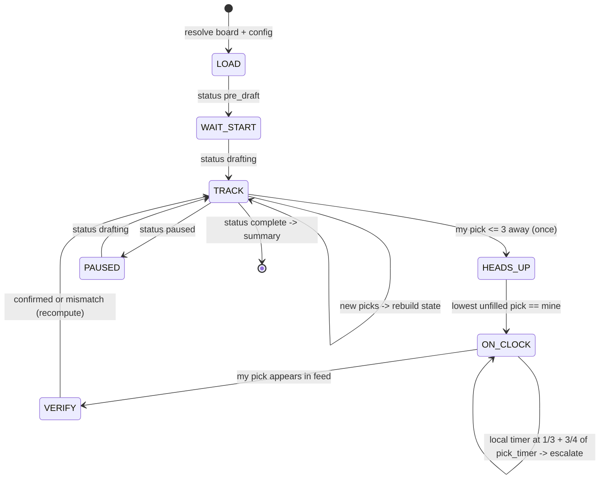

# Draft Bot — Execution Plan (Engine + Console Notifier)

**Status:** Draft for review · **Owner:** Andrew · **Branch:** `claude/sleeper-api-draft-selection-wua79b`

## 1. Goal

Build a draft assistant that watches a live Sleeper draft, scores the available players against Andrew's tiered board plus current roster needs, and emits a pick instruction (one primary + two fallbacks) at exactly the right moments. The instruction is delivered by a `Notifier`; this plan builds the engine and a **console notifier** only. A human relay (the league commissioner) executes picks in the Sleeper app — the Sleeper API is read-only, so the bot verifies outcomes by watching the pick feed, never by writing.

Out of scope for this plan (Phase 4 preview only): WhatsApp/Telegram delivery, the GitHub Actions live runner, and the autodraft fallback-queue compiler. Everything here is designed so those bolt on without reworking the engine.

## 2. Constraints that shape the design

| Constraint | Consequence |
|---|---|
| Sleeper API is read-only, no auth | Bot observes and instructs; confirmation loop closes by polling `/draft/<id>/picks`, not by inbound messages |
| Dev-sandbox network access varies (the Claude Code remote environment **can** reach `api.sleeper.app` — verified Aug 2026; a local sandbox may not) | **Fixture-first development** regardless — committed JSON snapshots keep tests deterministic and replays reproducible. Live fetching is confined to two small scripts, runnable from the remote session, Andrew's machine, or a GitHub Actions runner |
| Human actuator with latency | Every instruction carries ranked fallbacks; a verify step detects mismatches and recomputes from the roster actually held |
| Existing repo: Next 13, TS 4.8 `strict`, static export to Pages | Engine is pure TypeScript under `helpers/draft/` with zero DOM/React/Next imports, so a future web page and the bot script share it unchanged |
| Redraft league (lads) | Age/`years_exp` weighted zero; value comes from the current-season board. No rookie-pick handling |
| Board is ranked **with tiers** | Tier plateaus drive the value function; no external projections required |
| Rate limit ~1000 calls/min | 3 s poll ≈ 20 calls/min — far inside the limit; still implement backoff |

## 3. Architecture at a glance

```
scripts/
  fetchFixtures.ts      snapshot league/draft/players JSON (runs off-sandbox)
  resolveBoard.ts       board names -> Sleeper player_ids; fails loudly on ambiguity
  replay.ts             run engine against a completed draft; metrics + snapshots
  draftbot.ts           live loop: poll -> state machine -> engine -> notifier
helpers/draft/
  types.ts              Sleeper + engine domain types
  snake.ts              pick-number math (snake/linear, reversal round, traded picks)
  state.ts              picks feed -> BoardState (pool, rosters, on-clock, my next picks)
  needs.ts              roster_positions -> per-position need weights + forced-slot logic
  value.ts              tier/rank -> numeric value; off-board ADP interpolation
  survival.ts           Monte Carlo opponent model -> P(survive), E[best at next pick]
  recommend.ts          decision rule + guardrails -> Recommendation
  rng.ts                seeded PRNG (mulberry32) for deterministic sims/tests
  notifier.ts           Notifier interface + DraftMessage union + ConsoleNotifier
config/
  board.json            Andrew's tiered board + rules (do-not-draft, pins, floors, caps)
  board.resolved.json   generated by resolveBoard.ts (committed)
fixtures/
  <league>/<season>/    draft.json, picks.json, traded_picks.json, league.json
  players.trim.json     trimmed player map (~220 KB, committed)
docs/
  DRAFT_BOT_PLAN.md     this file
```

Data flow, live mode:

```
poll /draft/<id> + /picks ──> state.ts ──> recommend.ts ──> notifier.send()
        ▲                                        │
        └────── verify my pick landed ◄──────────┘
```

## 4. Data contracts

### 4.1 `config/board.json` (hand-authored)

```jsonc
{
  "season": 2026,
  "leagueId": "<2026 lads league id>",
  "draftId": "<2026 draft id>",
  "myUserId": "<andrew's sleeper user_id>",
  "players": [
    { "name": "Bijan Robinson", "pos": "RB", "team": "ATL", "tier": 1, "rank": 1 }
    // rank is overall 1..N; tier is per-position or overall — resolver validates monotonicity
  ],
  "doNotDraft": ["Player Name"],
  "pins": [{ "name": "Player Name", "fromRound": 2, "toRound": 3 }],
  "rules": {
    "maxByPos":    { "QB": 2, "RB": 6, "WR": 6, "TE": 2, "K": 1, "DEF": 1 },
    "minRoundByPos": { "QB": 11, "K": 13, "DEF": 12 },
    "stashRound":  12,          // Out/IR players excluded before this round
    "offBoardDiscount": 0.8
  }
}
```

`resolveBoard.ts` matches `name+pos+team` against `players.trim.json`, writes `board.resolved.json` with `player_id` attached, and **exits non-zero listing every unresolved or ambiguous name** — it never guesses. DEF ids are team abbreviations (`"PHI"`), so `player_id` is always `string`.

### 4.2 Fixtures (generated)

`fetchFixtures.ts` walks `previous_league_id` from the current lads league (same pattern as `helpers/api/getAllPreviousLeagueDetails.ts`) and snapshots, per season: `/league/<id>`, `/league/<id>/drafts`, `/draft/<id>`, `/draft/<id>/picks`, `/draft/<id>/traded_picks`. It also fetches `/players/nfl` once (~15 MB as of Aug 2026 — not the ~5 MB the docs suggest) and writes `players.trim.json` keeping fantasy positions (QB/RB/WR/TE/K/DEF) on an NFL roster — **any** `status`, since IR/Inactive players must stay in the pool for the `stashRound` logic — plus all 32 DEFs, with fields `{player_id, full_name, first_name, last_name, position, team, search_rank, injury_status, status, age}`. Measured against the live blob: ~1,060 players, roughly 220 KB. The full players blob is never committed.

Known fixture set on day one: lads 2022/2023/2024 + flexi 2023/2024 = **five completed snake drafts** for calibration (league IDs already in `config/config.ts`). *Now nine: rooting the walk at the current season's leagues reached lads 2020/2021/2025 and flexi 2025 as well.*

### 4.3 Engine surface (signatures locked in Phase 1)

```ts
buildState(cfg: DraftConfig, picks: SleeperPick[], board: ResolvedBoard, players: PlayerMap): BoardState
myPickNumbers(cfg: DraftConfig): number[]            // snake/linear + reversal_round + traded slots;
                                                     // my slot = draft.draft_order[cfg.myUserId]
needWeights(state: BoardState): Record<Position, number>
survival(state: BoardState, opts: SimOpts): SurvivalReport  // P(available at my next pick) per player,
                                                            // E[best value at my next pick] per position
recommend(state: BoardState, opts: SimOpts): Recommendation // { primary, fallbacks[2], forced?, rationale[] }
```

### 4.4 `DraftMessage` union (what any notifier receives)

```ts
type DraftMessage =
  | { kind: 'on_clock';   pickNo: number; instruction: Scored; fallbacks: Scored[] }
  | { kind: 'escalation'; pickNo: number; secondsElapsed: number; instruction: Scored; fallbacks: Scored[] }
  | { kind: 'pick_confirmed'; pickNo: number; player: Scored }
  | { kind: 'pick_mismatch';  pickNo: number; expected: Scored; actual: PlayerRef }
  | { kind: 'draft_paused' } | { kind: 'draft_resumed' }
  | { kind: 'draft_complete'; rosterSummary: string }
  | { kind: 'bot_error'; message: string; consecutiveFailures: number }
```

`ConsoleNotifier` renders these to stdout with timestamps — the exact strings a future WhatsApp notifier will send, so message copy gets reviewed in Phase 3, not rewritten in Phase 4.

## 5. Phase 0 — Scaffolding & fixtures (~half a day)

**Goal:** the repo can run engine code and tests offline, with real historical data committed.

1. Add dev deps `tsx` + `vitest`; npm scripts `fixtures`, `resolve-board`, `replay`, `bot`, `test`. Bot scripts target Node ≥ 20 (local is v22; the Node 16 Pages workflow is untouched).
2. `helpers/draft/types.ts` — Sleeper draft/pick/player types (only fields we consume) + engine domain types.
3. `scripts/fetchFixtures.ts` + `scripts/resolveBoard.ts` with hand-rolled validation (no schema lib) that fails loudly on shape drift.
4. Fixture acquisition, any path: (a) run `npm run fixtures` directly in the Claude Code remote session (verified: `api.sleeper.app` is reachable there), (b) Andrew runs it locally and commits, or (c) a one-off `fetch-fixtures.yml` workflow (`workflow_dispatch`) runs it on an Actions runner and commits to this branch.
5. `config/board.json` seeded with schema + a 10-player sample so the resolver and tests run before Andrew's real board lands.

**Exit criteria:** `npm test` runs a trivial spec green; five draft fixtures + `players.trim.json` committed; `npm run resolve-board` resolves the sample board or fails with a named-player report.

## 6. Phase 1 — Decision engine (~1–2 days)

**Goal:** given a board state, produce the pick a competent drafter would make, deterministically under a fixed seed.

1. **`snake.ts`** — pick-number math: snake + linear, `reversal_round` (3RR), traded picks from `traded_picks.json`, keeper picks (arrive pre-filled in the picks feed with `is_keeper` — none expected in 2026, confirmed, but folding them into state is free so they're handled defensively). My slot comes from `draft.draft_order[myUserId]` — hard error at LOAD if the configured `user_id` is missing from that map. Rejects `type: "auction"` loudly.
2. **`state.ts`** — fold the picks feed into: available pool, every roster's positional counts, my roster, current pick number, my remaining pick numbers, picks-until-my-next.
3. **`needs.ts`** — from `roster_positions`: unfilled dedicated starter → 1.0; FLEX-eligible while FLEX unfilled → 0.75; bench depth decays 0.5 / 0.35 / 0.2 by count already held; position at `maxByPos` cap → 0. Flex eligibility map: `FLEX = {RB,WR,TE}`, `SUPER_FLEX = {QB,RB,WR,TE}`, `REC_FLEX = {WR,TE}`, `WRRB_FLEX = {RB,WR}`; IDP slots → hard error (not this league). **Forced mode:** when `roundsRemaining == mandatoryUnfilledCount`, the candidate set collapses to unfilled mandatory positions — this is what stops the bot skipping K/DEF into an illegal lineup.
4. **`value.ts`** — on-board value: plateau per tier with geometric decay (tier 1 = 100, each tier × 0.85 — tunable), minus a small within-tier rank epsilon so ordering is stable. Off-board players: interpolate onto the board's value curve by ADP (`search_rank` proxy) × `offBoardDiscount`, always flagged `offBoard: true` in output.
5. **`survival.ts`** — Monte Carlo (default 2000 sims, seeded): each opponent pick is a Gumbel-perturbed draw from ADP order over the remaining pool, temperature growing with pick number and scaled by a live *reach calibration* (running deviation of actual picks from ADP order — computed identically in replay and live). Outputs per-player survival to my next pick and per-position expected best value at my next pick. Cost per decision ≈ sims × gap × ~50 candidates — milliseconds.
6. **`recommend.ts`** — the agreed rule: `score(p) = (V(p) − E[bestV(pos p) at my next pick]) × need(pos p)`, over the guardrail-filtered candidate set (do-not-draft, position caps, K/DEF round floors, Out/IR before `stashRound`, pins override everything in their round window). Primary = argmax; fallbacks = next two by score, forcing at least one different position when the top three are within 5% of each other. Rationale strings cover: tier scarcity ("3 left in RB T2"), survival %, roster slot filled, forced/pin flags.

**Exit criteria:** unit tests green for snake math (incl. 3RR + a traded pick), need weights across lineup shapes, forced-mode collapse, guardrails, value monotonicity (better tier ⇒ ≥ value), survival sanity (nearer pick ⇒ higher survival; deterministic under fixed seed). `recommend()` returns in < 250 ms on fixture-sized pools.

## 7. Phase 2 — Replay & calibration (~1 day)

**Goal:** evidence the engine is trustworthy, before it ever runs live.

1. **Synthetic market board per fixture** — 2026 tiers can't rank a 2024 pool, so the replay board is derived from the fixture itself: overall rank = actual pick order; per-position tiers auto-cut where the pick-number gap within a position exceeds a threshold. This validates *mechanics, needs, and survival calibration* — explicitly **not** the quality of Andrew's 2026 tiers.
2. **Replay mode A (agreement):** at each pick of a chosen slot, run `recommend()` against the true board state; record whether the actual pick was the engine's primary / in its top 3 / same position.
3. **Replay mode B (counterfactual roster):** engine actually takes its primary at each of my slots; opponents replay their real sequence, skipping players the engine already took. Final roster scored by summed market value vs the real roster's.
4. **Calibration report:** bucket survival predictions across all five fixture drafts (0–10%, 10–20%, …) and compare predicted vs empirical survival; report reach-residual distribution used for temperature scaling.
5. **Golden snapshot:** full replay transcript of lads 2024 committed as a vitest snapshot — any future engine change that shifts a recommendation shows up in review as a diff.
6. Tune the knobs (tier decay, temperature curve, need decay, off-board discount) against these metrics; record chosen defaults in the decision log below.

**Exit criteria:** zero guardrail violations across all five replays; K/DEF taken within their floors in every counterfactual; survival calibration mean absolute gap < 15 points per bucket; counterfactual roster value ≥ the real 2024 roster's (sanity bar, not a promise); golden snapshot committed. **Replay transcript reviewed by Andrew — this is the go/no-go gate for live use.**

## 8. Phase 3 — Live loop + console notifier (~1 day)

**Goal:** `npm run bot` babysits a full draft unattended, printing every message it would send.

1. **`notifier.ts`** — `Notifier { send(msg: DraftMessage): Promise<void> }`; `ConsoleNotifier` with timestamped, phone-width formatting (the copy is the deliverable — Phase 4 channels reuse it verbatim).
2. **Poller** — 3 s interval + jitter; exponential backoff 2→4→8→30 s on 429/5xx; `AbortController` timeouts; after 5 consecutive failures emit `bot_error` and keep retrying. Draft pause/resume tracked from `draft.status`.
3. **State machine** (below). On-clock detection: the lowest **unfilled** pick number equals one of mine ⇒ send `on_clock` — keyed on pick numbers, never `picks.length + 1`, so a non-contiguous feed (e.g. pre-filled keeper picks) can't shift the count. Sleeper's public API exposes the configured clock length (`draft.settings.pick_timer`, seconds) but not elapsed time, so escalation timers are a **local stopwatch** from on-clock detection, with thresholds derived from `pick_timer` (escalate at ~1/3, re-escalate at ~3/4 of the clock — 40 s / 90 s on the typical 120 s timer; those remain the fallbacks if `pick_timer` is 0/absent, i.e. no clock).
4. **Idempotency & crash safety** — every message keyed `(kind, pickNo)`; a sent-log persisted to disk means a crashed-and-restarted bot rebuilds state from the picks feed and never re-spams. All state is derivable from `picks` + sent-log.
5. **Verify loop** — when my pick lands: matches instruction (primary or a fallback) ⇒ `pick_confirmed`; anything else ⇒ `pick_mismatch`, and the engine recomputes from the roster actually held.
6. **Dry-run mode** — `npm run bot -- --dry-run --fixtures fixtures/lads/2024 --speed 60` replays a fixture through the *real* poller/state machine on an accelerated clock. This is how the whole loop is tested end-to-end offline, and the demo gate for the phase.



**Exit criteria:** dry-run of lads 2024 end-to-end with correct message sequence (heads-up once per pick, on-clock exactly on turn, verify after every one of my picks, summary at completion); kill −9 mid-draft + restart produces zero duplicate messages; a full-speed dry run stays under 25 API-equivalent calls/min.

## 9. Phase 4 preview — real notifiers + Actions runner (out of scope here)

For orientation only: `WhatsAppNotifier` (Meta Cloud API, free test number, service-window messages, permanent System User token) and optional `TelegramNotifier` (long-polled `getUpdates` — gives Andrew a 30 s approve/override window with no public webhook) implement the same `Notifier` interface; `draft-bot.yml` (`workflow_dispatch`, Node 20, `timeout-minutes: 350`, secrets for tokens) runs `scripts/draftbot.ts` on a runner with open egress; plus a T-30-min smoke message so a closed WhatsApp window is discovered before pick 1, and the autodraft queue compiler as third-line fallback. Nothing in Phases 0–3 needs rework to add these.

## 10. Testing strategy

- **Unit** (vitest): snake/reversal/traded-pick math, need weights, forced mode, guardrails, value function, message formatting. Deterministic via seeded `rng.ts` — no `Math.random` anywhere in the engine.
- **Golden snapshots:** full replay transcripts per fixture; engine changes surface as reviewable diffs.
- **Statistical:** survival calibration buckets across five drafts (the Phase 2 report doubles as a regression test with tolerances).
- **End-to-end:** Phase 3 dry-run through the real poller + state machine, including crash-restart.
- **Live smoke (pre-draft day):** bot pointed at a Sleeper **mock draft** Andrew joins from his phone — the only test needing real network, run from his machine.

## 11. Risks & mitigations

| Risk | Impact | Mitigation |
|---|---|---|
| `search_rank` is a weak ADP proxy | Survival estimates off | Calibration vs 5 real drafts (Phase 2); temperature scaling from observed reach; fallbacks absorb residual error |
| Sleeper response shapes drift from fixtures | Live crash | Loud validators at every parse; `bot_error` messages rather than silent death; fixtures refreshed close to draft day |
| No *elapsed* pick clock in public API (`settings.pick_timer` gives length only) | Escalation timing is approximate | Local stopwatch from on-clock detection; thresholds at ~1/3 and ~3/4 of `pick_timer`, 40 s/90 s fallback when no clock |
| Commissioner mis-picks or autodraft fires first | Wrong roster assumed | Verify step + `pick_mismatch` + recompute from actual roster |
| Andrew's board has unresolvable names | Bad or missing values | Resolver hard-fails with a per-name report; no guessing |
| League is auction, IDP, or otherwise odd | Engine assumptions break | Hard errors on unsupported `type`/slots at LOAD, not mid-draft |
| Sandbox can't hit the API | Can't test live paths in dev | Everything runs on fixtures; the two network scripts run locally or via the one-off Actions workflow |

## 12. Inputs needed from Andrew

1. **2026 lads league ID + draft ID** (`config/config.ts` currently ends at 2024).
2. **Andrew's Sleeper `user_id`** (or username, resolved once via `/user/<username>`) — `myPickNumbers()` needs it to find the draft slot in `draft.draft_order`. Display-name matching is possible but ambiguous; an explicit id is one config field.
3. **The tiered board** — any format with name/pos/tier (+ optional overall rank); resolver handles the rest.
4. ~~Keepers~~ **Confirmed: no keepers in the 2026 league** (Andrew, Aug 2026). Still outstanding: confirmation of **no IDP/auction** surprises (or say so, and Phase 1 scopes them in).
5. (Optional, Phase 4) mock-draft observation of autodraft queue behaviour — only affects the fallback queue.

## 13. Decision log

| Decision | Choice | Why |
|---|---|---|
| Runner/test tooling | `tsx` + `vitest` as devDeps | esbuild-based, indifferent to the repo's TS 4.8; zero config |
| Engine location | `helpers/draft/`, pure TS | Matches repo convention; shared by bot script and any future page |
| Fixtures | Trimmed, committed to git | Offline-first dev is mandatory here; ~400 KB is cheap; full 5 MB players blob excluded |
| Randomness | Seeded mulberry32, no `Math.random` | Deterministic sims → testable engine, reproducible replays |
| Validation | Hand-rolled asserts, no schema lib | Small surface; keeps the dep tree flat |
| Value function | Tier plateaus, geometric decay, rank epsilon | Uses exactly the information Andrew's board encodes; tunable in Phase 2 |
| Opponent model | Gumbel-perturbed ADP order, calibrated temperature | Simple, fast, calibratable against 5 real drafts |
| Byes | Deferred (optional 0.97 backup-collision multiplier later) | Marginal in redraft; not worth v1 complexity |
| Synthetic replay tiers | Tier = draft round (not per-position gap cuts) | Tier feeds the value curve, which must stay monotone in overall market order; a per-position tier index would hand tier-1 value to a round-13 kicker |
| Replay reachScale | Neutral (1.0) in replay; live calibration vs the real board | The market board's ADP is the realized pick order, so observed displacement is 0 by construction there |
| Replay lineup check | Parity rule: missing starter counts only if the real roster filled it | Market pools contain only drafted players (lads 2023: 8 Ks for 12 teams) — some lineups are genuinely unfillable in replay |
| Schedule-forced mode | Forced collapse also fires when the union of my picks that land before each unfilled starter's supply horizon can only just cover those slots | One-pick-ahead VONA defers K/DEF into extinction during late runs; the 2023/2024 replays proved it |
| Temperature defaults | base 3, slope 0.02/pick | Phase 2 calibration: rooms pick close to market order (weighted MAE 5.5pts across 46k samples) |
| Keepers | None in 2026 (confirmed by Andrew); `is_keeper` picks still folded into state defensively | Costs nothing and protects the pick-number math if a surprise appears in the feed |
| Confirmation loop | Via Sleeper picks feed only | API is read-only; also removes any need for inbound webhooks |
| Message copy | Finalised in Phase 3 console output | WhatsApp/Telegram in Phase 4 reuse strings verbatim |

### Added after Phase 3

Everything above describes the engine as designed. These came out of the 2025
backtest and the review that followed it, and they are what will actually run.

| Decision | Choice | Why |
|---|---|---|
| Board order vs scarcity | `vonaFromRound` — board order below it, scarcity from it. Currently 9 | The two compete and cannot be blended. Within a tier the ordering term is worth hundredths of a point against several points of scarcity, so the board's ordering was arithmetically invisible: the engine passed over the board's rank-2 player for its rank-4 player at pick 2. Raising the epsilon enough to compete would invert the tier plateaus |
| Round floors | `minRoundByPos`, replacing `minRoundK`/`minRoundDEF` | Only kickers and defenses could carry a floor, so "no quarterback before round 11" was inexpressible short of re-tiering the board. The scarcity override generalised with it |
| Roster need | `useRosterNeed`, default on, **off** for 2026 | Andrew judges a pick on his board and on scarcity alone. Position still matters through the caps and floors, which are filters rather than weights |
| Forced starters | `useForcedStarters`, default on, **on** for 2026 | With need weighting off, nothing else fills an empty quarterback slot — measured: the engine drafted no quarterback at all with both disabled. It fires once, at the final pick, and only when a required slot is still empty |
| Zero-capped positions | `effectiveLineup` turns their starter slot into bench | A position capped at zero never fills, so `unfilledMandatoryCount` never reaches zero, forced mode fires on the last picks, the cap guardrail rejects every candidate, and `recommend()` drops into its relax-everything path — arbitrary picks in the closing rounds |
| Guardrail relaxation | Graded: floors, then stash, then the forced collapse, then caps — each named in the rationale | Dropping all of them at once and reporting only "guardrails relaxed" made a breached position cap indistinguishable from a healthy pick. The live-rules replay produced seven such breaches with nothing explaining them |
| Players Sleeper does not rank | ADP interpolated from the board's own rank→ADP curve | All 32 defenses have `search_rank: null`. Sharing one sentinel gave every one survival 1.0, so E[best DEF] equalled the best defense's own value and its edge was exactly zero — a defense could never be chosen on score, only by forced mode |
| Replay coverage | `npm run replay -- --rules live` overlays `config/board.json` | The whole replay corpus, golden snapshot included, exercised `marketRules`, which sets none of the rules above. It described a configuration that will never run |
| Live-mode gates | Explicit `draftReady`, plus a 72-hour limit on the player map (48 until 2026-09-02) | The ids were filled in weeks before the board was, so "the ids look real" was never evidence the board was ready. The draftable pool is exactly the player map's keys and the stash rule reads its injury designations |

### Phase 4 (delivery + runner) — as built

Designed and executed under `docs/plans/draft-night-delivery/`. WhatsApp is
Twilio's sandbox rather than Meta's Cloud API, Telegram was dropped, and
Discord was added for the group audience.

| Decision | Choice | Why |
|---|---|---|
| WhatsApp transport | Twilio Sandbox for WhatsApp, raw `fetch`, no SDK | Working in minutes with no business verification; same WhatsApp platform underneath. The 72-hour join lapse is a draft-morning checklist item |
| Group audience | Discord webhook, not a WhatsApp group | The WhatsApp Business Platform cannot post into group chats at all; a webhook is free and needs no bot account |
| One rendering on every channel | Phones, Discord and the runner console all send `formatDraftMessage`'s single public-safe string | Superseded the branch's per-channel audience design when it collided with the one-rendering decision merged from the mock workstream: the console text gets relayed verbatim, so a "private" rendering was never private, and a forecast the relay cannot act on is noise. Confirmed by Andrew at merge time (Aug 2026) |
| Channel configuration | Environment variables, all-or-nothing per channel | No env vars = today's console-only behaviour; a half-set channel fails loudly at startup, where a restart is cheap, not at pick 1 |
| Startup smoke | The existing `loaded` READY message, plus `npm run notify:test` | READY already flows through every notifier before pick 1; the smoke script proves channels with no draft at all |
| Remote runner | `draft-bot.yml`: manual `workflow_dispatch` + cron 18:40 UTC Sep 5, year-guarded to 2026 in a step (GitHub cron has no year field), `concurrency: draft-bot`, player map refreshed on the runner, JSONL log uploaded as an artifact | The guard fails visibly rather than soft-skipping; delete the schedule block after draft day and the guard makes forgetting harmless |
| Positional ceilings | `maxCountByRound` — at most N at a position through round R; RB 3 through round 6 configured beside the RB 3-by-5 quota | Andrew wanted exactly 3 RB + 3 WR/TE in six rounds. A second obligation (WR quota) had proved unsafe: two quotas claiming every pick in one window bind independently and can strand each other. A ceiling is a prohibition — always satisfiable by taking someone else — so the pair is safe, and with only RB/WR/TE draftable before round 12 it yields the full 3+3 shape |
| WhatsApp provider, revised | Vonage Messages API sandbox; the Twilio notifier kept for a paid account | Twilio's trial tier ("Try out WhatsApp") rejects freeform `Body` outright — `ContentSid Required`, canned templates only, session window irrelevant — and lifting it needs a £20 top-up. Vonage's sandbox allows freeform in-session for free (fair use 100 msgs/month: one draft night to two phones, so rehearsals stay on Discord). Telegram ruled out: nobody in the league has it |
